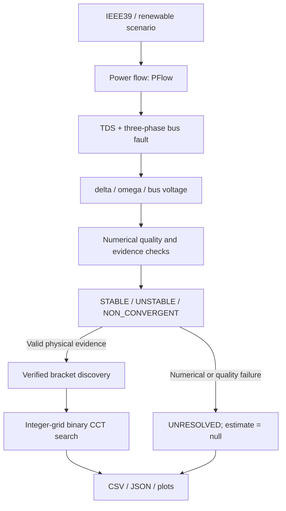

# IEEE39 Renewable Transient Stability & CCT Toolkit

[中文说明](README_CN.md)

A Python/ANDES toolkit for automated IEEE 39-bus transient stability analysis,
critical clearing time (CCT) search, and renewable scenario comparison.
Verified intervals, numerical failures, model hashes, and reproducible entry points are explicit.


## Highlights

- IEEE 39-bus dynamic simulation with ANDES 2.0.0.
- Automated three-phase bus faults and batch analysis.
- COI-based rotor-angle screening using setup-time machine inertia.
- Bounded bracket discovery and integer-grid binary CCT search.
- Explicit STABLE / UNSTABLE / NON_CONVERGENT handling.
- Four renewable scenarios spanning 0% to 33.1% active-power share.

## Key Results

| Study | Verified result |
|---|---|
| Official baseline | 15 representative fault buses: 13 resolved, 1 >500 ms lower bound, 1 numerical unresolved |
| Renewable study | 4 scenarios; 0 / 8.8 / 22.4 / 33.1% actual share; 5 fault buses; 20 cells |
| Renewable CCT | 10 resolved, 3 >500 ms lower bounds, 7 numerical unresolved |
| Unit tests | 99 / 99 passing; no TDS runs in unit tests |

All resolved intervals have a **7.8125 ms final width** on a **1/128 s clearing-time grid**.
An estimate is the interval midpoint, not a physical CCT known beyond simulation resolution.
Full-precision summaries: [baseline CSV](examples/results/benchmark_cct_summary.csv),
[renewable CSV](examples/results/renewable_scenario_summary.csv), and [results](docs/results.md).

## Main Findings

1. Fault location strongly affects the verified CCT intervals.
2. These renewable scenarios do not support a simple “higher renewable share always reduces CCT” conclusion.
3. Some renewable/fault combinations encounter Newton integration failure. They remain unresolved instead of being misclassified as unstable.

## Method



Faults start at 1.0 s with `xf = 1e-4 pu`; clearing retains the original network.
The observation horizon is 8.0 s. Each simulation loads its model independently.
See [methodology](docs/methodology.md) for bracket rules and frozen solver settings.

## Renewable Scenarios

| Scenario | Renewable buses | Actual active-power share | SG / RenGen |
|---|---|---:|---:|
| S0 | None: adapted SG baseline | 0% | 10 / 0 |
| S1 | 37 | 8.845% | 9 / 1 |
| S2 | 37, 38 | 22.440% | 8 / 2 |
| S3 | 37, 38, 32 | 33.087% | 7 / 3 |

The system-level renewable model is **REGCP1 + PLL2 + REECB1**.
Replacement retains the static dispatch and matches the original machine rating.
Bus39, the external-system equivalent, remains synchronous in the main sequence;
Slack Bus31 is also retained. Bus39 replacement cases are archived stress scenarios,
excluded from the main comparison.
The [main manifest](cases/renewable/main/manifest.json) records exact shares, inertia accounting, and workbook hashes.

## CCT Benchmark


**13/15 resolved.** Bus1 remains stable at 500 ms within the tested range;
Bus6 is numerical unresolved. Neither appears as a fabricated exact CCT in the ranking.
The official benchmark and adapted renewable S0 are separate baselines.

## Renewable Scenario Comparison

The fixed matrix uses Bus10, Bus16, Bus23, Bus25, and Bus37 for every scenario.
Resolved Bus23 midpoints are nondecreasing; other buses contain unresolved values or lower bounds.
The observed changes are **scenario- and fault-location-dependent**.
Replacement location, remaining SG set, converter dynamics, and inertia change together,
so active-power share alone is not established as the cause.


The Bus16 overlay shows the remaining synchronous generators under the same 125 ms fault.
Early failures retain only their valid plotted prefix and an explicit status label.

<details>
<summary>CCT versus actual renewable share</summary>


Only adjacent resolved points are connected. Bars show verified stable/unstable brackets;
numerical failures and >500 ms lower bounds are not assigned artificial numeric values.

</details>

## Quick Start

Use Python 3.13. From the repository root:

```bash
python -m venv .venv
```

Windows:

```powershell
.venv\Scripts\python -m pip install -r requirements.txt
.venv\Scripts\Activate.ps1
```

Linux/macOS:

```bash
source .venv/bin/activate
python -m pip install -r requirements.txt
```

```bash
python -m unittest discover -s tests -v
python run_fault.py --bus 16 --clear-time 0.125
python run_cct.py --bus 16 --tc-max 0.1953125
```

The existing batch and renewable comparison entry points are:

```bash
python run_batch.py --output results/my_benchmark --figures figures/my_benchmark
python run_scenario_comparison.py --output results/my_renewable_comparison --figures figures/my_renewable_comparison
```

Output directories must be empty. Batch commands run multiple simulations; they are
not part of the fast unit-test workflow. The shipped [example results](examples/results/)
and figures can be inspected without running any simulations.

## Project Structure

```text
cases/                    # Official, adapted, main and stress workbooks + manifests
configs/                  # Fault settings and frozen solver configuration
src/ieee39ts/             # Simulation, screening, CCT, batch and comparison modules
tests/                    # 99 pure tests + compact accepted-metadata fixtures
examples/results/         # Curated verified CSV/JSON summaries
docs/assets/              # Five existing result figures; PNG and SVG
docs/                     # Method, results, limitations and model provenance
run_fault.py
run_cct.py
run_batch.py
run_scenario_comparison.py
```

## Stability Criterion

```text
delta_COI = sum(M_i * delta_i) / sum(M_i)
delta_rel_i = delta_i - delta_COI
separation = max(delta_rel_i) - min(delta_rel_i)
```

`M_i` comes from setup-time `ANDES GENROU.M.v`, on the common system base.
Credible simultaneous rotor-angle separation **>=180° within an 8 s horizon**
is the screening criterion. Raw machine-base `2H` is not mixed across machines.

**The criterion evaluates the remaining synchronous-machine rotor-angle subsystem.
It is not sufficient to establish converter internal stability.** PLL channels are diagnostics,
not COI members or additional stability thresholds.

## Numerical Failures

TDS failure is not automatically classified as physical instability.
The pipeline distinguishes **STABLE**, **UNSTABLE**, and **NON_CONVERGENT**,
while recording `simulation_status` separately.
Credible angle separation before a later abnormal tail can retain UNSTABLE with failure metadata.
Failure before credible separation is NON_CONVERGENT; CCT search stops without moving either boundary.

## Reproducibility

The saved studies used **Python 3.13.15 / ANDES 2.0.0**; direct dependencies are pinned.
Workbooks have SHA256 manifests, and exported summaries/figures have source hashes.
The renewable CLI reads [frozen solver values](configs/frozen_solver.json) locally,
without requiring an archived run or any previous project directory.

Resolved searches use the 1/128 s grid and 7.8125 ms final interval width.
Raw trajectories, execution logs, virtual environments, caches, and internal acceptance
archives remain local and are excluded from Git.
See [model provenance](docs/model_provenance.md), [third-party notices](THIRD_PARTY_NOTICES.md),
and the [release checklist](docs/github_release_checklist.md).

## Limitations

- IEEE39 benchmark and adapted-system results do not validate an operating grid.
- Renewables use a system-level generic GFL model.
- Remaining-SG 180° screening is not a converter-internal stability criterion.
- The 8 s horizon and bounded 500 ms search limit the reported results.
- Numerical failures limit comparison; no monotonic renewable-share effect is claimed.

## License

**GPL-3.0-or-later**. See [LICENSE](LICENSE) and
[THIRD_PARTY_NOTICES.md](THIRD_PARTY_NOTICES.md) for ANDES and upstream model attribution.
