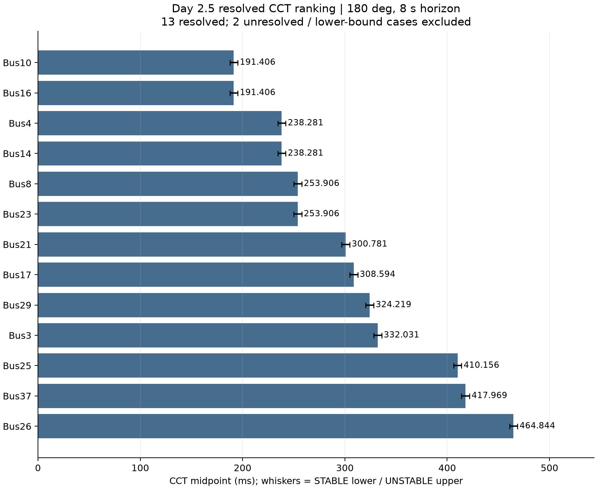
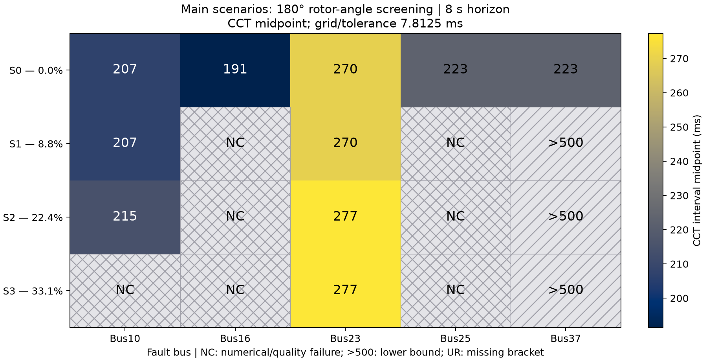
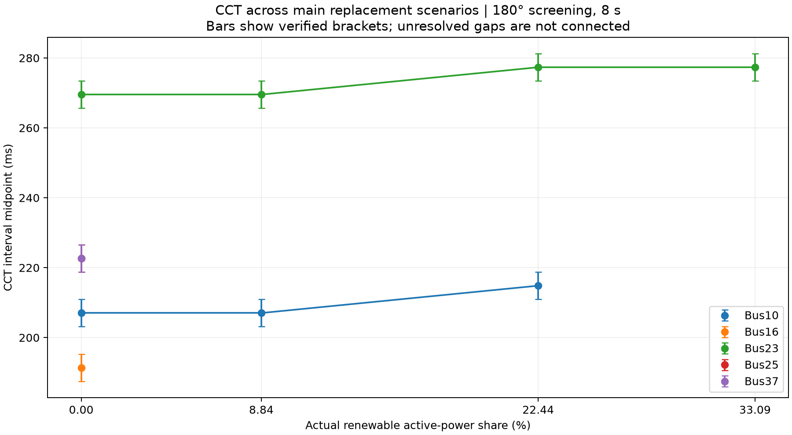
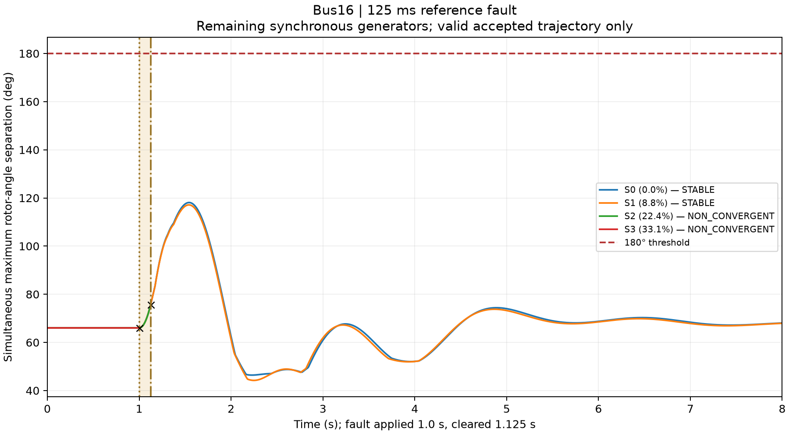
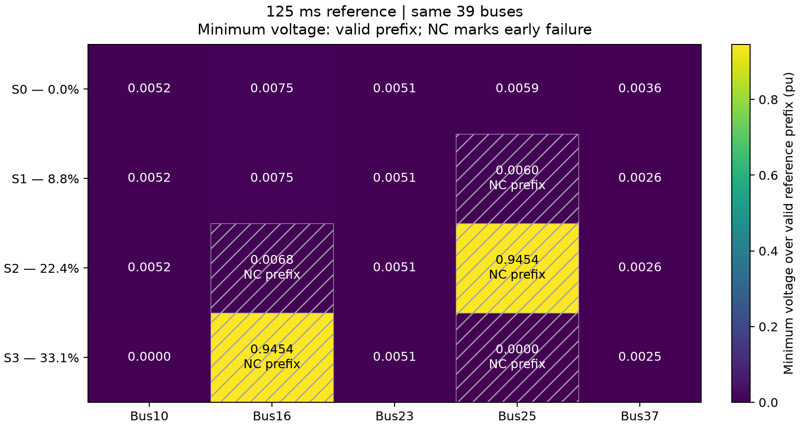

# Verified results

All values below come from the frozen completed studies. Publication adds no
simulations and changes no physical result. Full-precision tables are shipped in
[examples/results](../examples/results/) with original-source digests.

## Official 15-bus benchmark

13 CCT intervals resolved. Bus1 is stable at 500 ms within the tested range;
Bus6 stops at a numerical failure, retaining its existing verified bounds.
The smallest resolved midpoint is 191.40625 ms (Bus10 and Bus16), and the largest
is 464.84375 ms (Bus26). Ranking includes resolved intervals only.

[Benchmark CSV](../examples/results/benchmark_cct_summary.csv) ·
[Benchmark JSON](../examples/results/benchmark_cct_summary.json)

## Main renewable comparison

| Scenario / actual share | Bus10 | Bus16 | Bus23 | Bus25 | Bus37 | Resolved / unresolved |
|---|---:|---:|---:|---:|---:|---:|
| S0 / 0% | 207.03125 | 191.40625 | 269.53125 | 222.65625 | 222.65625 | 5 / 0 |
| S1 / 8.844994% | 207.03125 | NC | 269.53125 | NC | >500 | 2 / 3 |
| S2 / 22.440077% | 214.84375 | NC | 277.34375 | NC | >500 | 2 / 3 |
| S3 / 33.086829% | NC | NC | 277.34375 | NC | >500 | 1 / 4 |

Numeric cells are interval midpoints in ms. Every resolved interval has width
7.8125 ms. NC means numerical unresolved; >500 is a tested lower bound.
Both categories have null estimates and receive no artificial numerical color.

Bus23 midpoints are nondecreasing across all four resolved cells. Bus10's first
three midpoints are flat then increase; its fourth cell is unresolved.
Bus16 and Bus25 lack complete four-point results. Bus37 provides lower bounds
after S0, not exact CCT values. These data do not establish a monotonic decline
with renewable share, and do not isolate active-power share as the causal factor.

The smallest renewable resolved midpoint is 191.40625 ms (S0/Bus16); the largest
is 277.34375 ms (S2/Bus23 and S3/Bus23).

## 125 ms reference response

15 references are STABLE and 5 are NON_CONVERGENT. The largest remaining-SG
angle separation among the tested references in each scenario is:

| Scenario | Fault bus | Peak separation, deg |
|---|---:|---:|
| S0 | 16 | 118.085235 |
| S1 | 16 | 117.108028 |
| S2 | 10 | 111.489661 |
| S3 | 23 | 102.204745 |

Different SG sets and early failed prefixes limit cross-scenario severity claims.

## Numerical unresolved cases

| Cell | Failed duration | Search phase / retained bounds |
|---|---:|---|
| S1 / Bus16 | 250 ms | Discovery; stable lower 195.3125 ms |
| S1 / Bus25 | 125 ms | Reference failure; CCT not pursued |
| S2 / Bus16 | 125 ms | Reference failure; CCT not pursued |
| S2 / Bus25 | 125 ms | Reference failure at fault application; CCT not pursued |
| S3 / Bus10 | 171.875 ms | Binary midpoint; bounds [148.4375, 195.3125] ms |
| S3 / Bus16 | 125 ms | Reference failure at fault application; CCT not pursued |
| S3 / Bus25 | 125 ms | Reference failure; CCT not pursued |

All seven have Newton/integration termination with time step reduced to zero,
without an earlier credible 180° crossing. No failure point is bypassed.
The largest valid-prefix PLL frequency deviation is 3.086921 Hz (S2/Bus16), a
diagnostic rather than a new physical stability label. No independent converter
diagnostic extraction error or non-finite diagnostic array was detected.

## Optional voltage overview

The metric uses the same 39 buses and includes the fault-on dip. NC cells show
only the accepted prefix. S2/Bus25 and S3/Bus16 fail at fault application: their
0.945435 pu minima and zero PLL deviations describe pre-fault data, not successful
fault response.

The renewable study used 111 actual TDS calls (20 references plus 91 search trials),
462.17 s for the simulation workflow and 464.81 s for the main CLI including plots.
These are historical run timings, not portability/performance guarantees.

[Renewable CSV](../examples/results/renewable_scenario_summary.csv) ·
[Renewable JSON](../examples/results/renewable_scenario_summary.json) ·
[Limitations](limitations.md)
